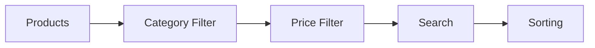

  

A modern **API-driven e-commerce application** that simulates a real mobile shopping experience with product discovery, filtering, cart management, optional authentication, and persistent user state.

Built to demonstrate **production-style commerce architecture, scalable state management, and responsive UI design**.

---

## 🚀 Features

- 🛍️ Product browsing & discovery  
- 🔎 Search, filtering & sorting  
- ❤️ Favorites & 🛒 Cart management  
- 🔐 Optional authentication (guest-friendly)  
- 💾 Persistent user state  
- 📱 Responsive grid layout  
- 💸 Discount & pricing system  
- 🧠 Global state synchronization  

---

## 🏗️ Technical Architecture

1️⃣ **Data Layer**  
API product dataset + local persistence.

2️⃣ **State Layer**  
Centralized global state (Provider-style).

3️⃣ **UI Layer**  
Reusable components & responsive layouts.

4️⃣ **Persistence Layer**  
Cart, favorites & session stored locally.

5️⃣ **Authentication Layer**  
Optional login (guest → authenticated).

---

## 🧭 Application Flow

## 🖥️ User Experience

- Sectioned commerce homepage  
- Hero deals & featured products  
- Sticky add-to-cart actions  
- Filter & sort toolbar  
- Recently viewed section  
- Cart savings display  

---

## 🛠️ Tech Stack

| Layer | Technology |
|------|-----------|
Frontend | Flutter UI / Responsive Layout |
State | Provider / Context Pattern |
Data | REST API Products |
Persistence | Local Storage |
Auth | Simulated OTP / Email |
Deployment | Vercel (Web Build) |

---

## ⚙️ Workflow & Logic

### 1️⃣ Product Loading
- Fetch products from API  
- Convert USD → INR  
- Generate persistent discounts  

### 2️⃣ Global State
Centralized state includes:

- products & filtered list  
- search & filters  
- cart & quantities  
- favorites  
- browsing history  
- auth session  

### 3️⃣ Filtering Pipeline

### 4️⃣ Cart Logic

- Quantity aggregation  
- Increment / decrement controls  
- Subtotal & savings calculation  
- Discount mapping per product  

---

### 5️⃣ Persistence

Stored locally:

- cart  
- favorites  
- browsing history  
- discounts  
- user session  

State is restored automatically on next app launch.

---

## 🧩 Reusable Components

- **ProductCard** → used across all product grids  
- **SectionContainer** → standardizes homepage sections  
- **Toolbar** → filtering & sorting controls  
- **GridLayout** → responsive column layout  

---

## 📱 Responsive Layout

- Mobile → 2 columns  
- Tablet/Desktop → 3 columns  

Adaptive spacing and equal card heights ensure consistent UI across devices.

---

## ⚡ Performance

- Single dataset reused across screens  
- Derived filtered lists (no duplication)  
- ID-based favorites lookup  
- Cached discounts per product  
- Persistence loaded once at startup  

---

## 📈 Scalability

Architecture supports future expansion:

- Backend authentication  
- Cloud data sync  
- Checkout & payments  
- Order management  
- Reviews & ratings  
- Recommendation engine  

---

## 🧪 Testing Strategy

Business logic separated from UI enables testing of:

- cart calculations  
- filtering pipeline  
- discount logic  
- authentication state  

---

# ✅ Conclusion

The **Bespoke Product App** demonstrates how a modern mobile commerce experience can be built using a clean architecture, centralized state management, and persistent user data — without requiring a backend.

The project showcases production-style UI patterns, scalable data flow, and reusable component design, making it a strong foundation for real-world e-commerce applications.

---

## 👨‍💻 Author  

**Lomada Siva Gangi Reddy**  
- 🎓 B.Tech CSE (Data Science), RGMCET (2021–2025)  
- 💡 Interests: Python | Machine Learning | Deep Learning | Data Science  
- 📍 Open to **Internships & Job Offers**

 **Contact Me**:  

- 📧 **Email**: lomadasivagangireddy3@gmail.com  
- 📞 **Phone**: 9346493592  
- 💼 [LinkedIn](https://www.linkedin.com/in/lomada-siva-gangi-reddy-a64197280/)  🌐 [GitHub](https://github.com/shivareddy2002)  🚀 [Portfolio](https://lsgr-portfolio-pulse.lovable.app/)

---

  

