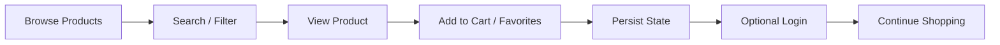
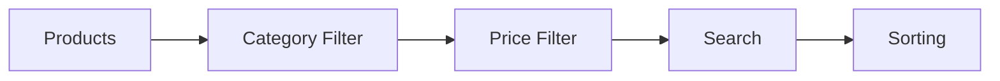

  

A modern **API-driven e-commerce application** that simulates a real mobile shopping experience with product discovery, filtering, cart management, optional authentication, and persistent user state.

Built to demonstrate **production-style commerce architecture, scalable state management, and responsive UI design**.

---

## 🚀 Features

- 🛍️ Product browsing & discovery  
- 🔎 Search, filtering & sorting  
- ❤️ Favorites & 🛒 Cart management  
- 🔐 Optional authentication (guest-friendly)  
- 💾 Persistent user state  
- 📱 Responsive grid layout  
- 💸 Discount & pricing system  
- 🧠 Global state synchronization  

---

## 🏗️ Technical Architecture

1️⃣ **Data Layer**  
API product dataset + local persistence.

2️⃣ **State Layer**  
Centralized global state (Provider-style).

3️⃣ **UI Layer**  
Reusable components & responsive layouts.

4️⃣ **Persistence Layer**  
Cart, favorites & session stored locally.

5️⃣ **Authentication Layer**  
Optional login (guest → authenticated).

---

## 🧭 Application Flow

## 🖥️ User Experience

- Sectioned commerce homepage  
- Hero deals & featured products  
- Sticky add-to-cart actions  
- Filter & sort toolbar  
- Recently viewed section  
- Cart savings display  

---

## 🛠️ Tech Stack

| Layer | Technology |
|------|-----------|
Frontend | Flutter UI / Responsive Layout |
State | Provider / Context Pattern |
Data | REST API Products |
Persistence | Local Storage |
Auth | Simulated OTP / Email |
Deployment | Vercel (Web Build) |

---

## ⚙️ Workflow & Logic

### 1️⃣ Product Loading
- Fetch products from API  
- Convert USD → INR  
- Generate persistent discounts  

### 2️⃣ Global State
Centralized state includes:

- products & filtered list  
- search & filters  
- cart & quantities  
- favorites  
- browsing history  
- auth session  

### 3️⃣ Filtering Pipeline

